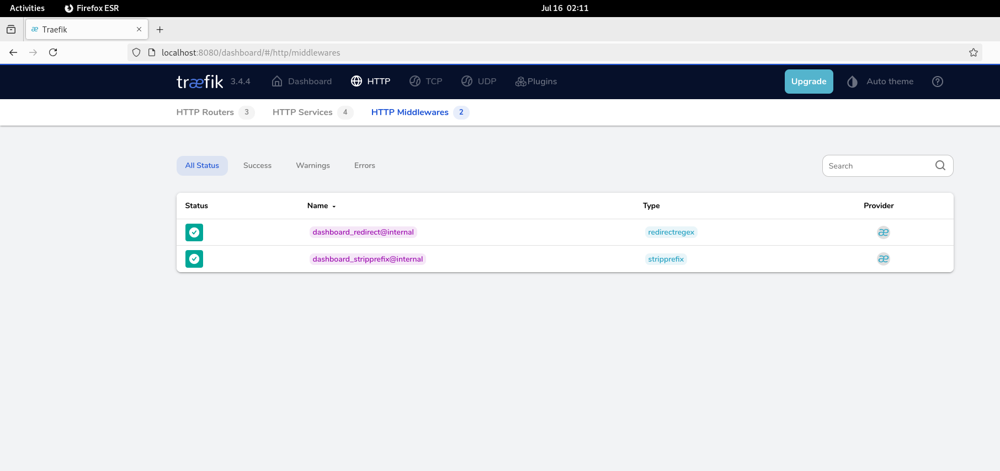

# Traefik + Whoami HTTP Service Example

A simple -localhosted- example of using Traefik as a reverse proxy with a whoami service using Podman Compose.

## Purpose

This project demonstrates:
- **Traefik v3.x** reverse proxy configuration
- **Podman v5.x rootless containers** with service discovery
- **Environment-based configuration** for portability
- **Basic HTTP routing** with host-based rules

## Description

The setup includes:
- **Traefik**: Reverse proxy with dashboard on port 8080
- **Whoami**: Simple HTTP service responding with container info
- **Custom network**: Isolated bridge network with defined subnet
- **Environment variables**: All configuration externalized

## Prerequisites

### System Requirements
- **Podman 5.x** (rootless mode)
- **podman-compose** installed
- **Linux system** with systemd user services (debian 12 64b)

### Podman Socket Setup
```bash
# Enable Podman socket for rootless containers
systemctl --user enable --now podman.socket

# Verify socket exists
ls /run/user/$(id -u)/podman/podman.sock

# Test socket works
podman --remote ps
```

### DNS Configuration
Add to `/etc/hosts`:
```
127.0.0.1 whoami.localhost
```

## Setup Instructions

### 1. Clone and Configure
```bash
git clone <this-repo>
cd traefik-whoami-example

# Copy environment template
cp .env.example .env

# Edit .env if needed (adjust user ID, ports, etc.)
nano .env
```

### 2. Reset Podman (if needed)
```bash
# Clean up any existing containers/networks
./reset_podman_socket.sh
```

### 3. Start Services
```bash
# Start the stack
podman-compose --env-file .env -f podman-compose-whoami.yaml up -d

# Check containers are running
podman ps -a

# View logs
podman logs -f traefik_dash
```

### 4. Test Services

**Traefik Dashboard:**
```bash
curl http://localhost:8080/dashboard/
# Or open in browser: http://localhost:8080/dashboard/
```

**Whoami Service:**
```bash
curl http://whoami.localhost:8000/
# Or open in browser: http://whoami.localhost:8000/
```

**Service Discovery Check:**
```bash
# Check Traefik discovered the whoami service
curl http://localhost:8080/api/http/routers
curl http://localhost:8080/api/http/services
```

## Configuration Details

### Port Mapping
- **8000**: Whoami service (HTTP)
- **8080**: Traefik dashboard

### Network Architecture
- **Custom bridge network**: `proxy_net` (10.89.1.0/24)
- **Automatic service discovery** via Docker provider (used by the podman socket)
- **Container-to-container communication** on isolated network

### Key Configuration Points
1. **Entrypoint port must match container port** in port mapping
2. **Podman socket** mounted for service discovery
3. **exposedByDefault=false** requires explicit `traefik.enable=true` labels (to be declared in every service)
4. **Network name** must match across services and network definition

## Troubleshooting

### Container Won't Start
```bash
# Check logs for errors
podman logs traefik_dash
podman logs simple-service

# Port conflicts?
netstat -tulpn | grep :8000
netstat -tulpn | grep :8080
# note: "netstat" or "ss"
```

### Service Not Found (404)
```bash
# Check if Traefik discovered the service
curl http://localhost:8080/api/http/routers | jq '.[].name'

# Check container networks
podman inspect simple-service | grep -A5 Networks
```

### Socket Issues
```bash
# Reset and recreate socket
./reset_podman_socket.sh

# Check socket permissions
ls -la /run/user/$(id -u)/podman/podman.sock
```

### Browser Cache Issues
- **Clear browser cache** for localhost
- **Try incognito/private mode**
- **Hard refresh** (Ctrl+F5)

## Screenshots

### Traefik Dashboard

*Traefik dashboard showing dashboard home page*

### Traefik Router

*Traefik dashboard showing discovered routers*

### Traefik Middleswares

*Traefik dashboard showing middlewares*

### Traefik Services

*Traefik dashboard showing discovered services*

### Whoami Service Response

*Whoami service showing container information and forwarded headers*

### Service Discovery

*Traefik API showing discovered whoami service with health status*

## Next Steps

This basic HTTP setup can be extended with:
- **HTTPS/TLS** with self-signed or Let's Encrypt certificates
- **Static configuration files** (traefik.yml + dynamic.yml)
- **Additional middleware** (authentication, rate limiting)
- **Multiple services** with path-based routing
- **Docker Swarm** or **Kubernetes** deployment

## Notes

⚠️ **NEVER use this configuration in production without proper security measures**
- Remove `api.insecure=true`
- Add authentication to dashboard
- Use HTTPS with valid certificates
- Implement proper access controls

## License

MIT License - see LICENSE file for details.

---

**Created**: July 14, 2025  
**Author**: XCS HornetGit  
**Version**: Podman 5.x, Traefik v3.4+